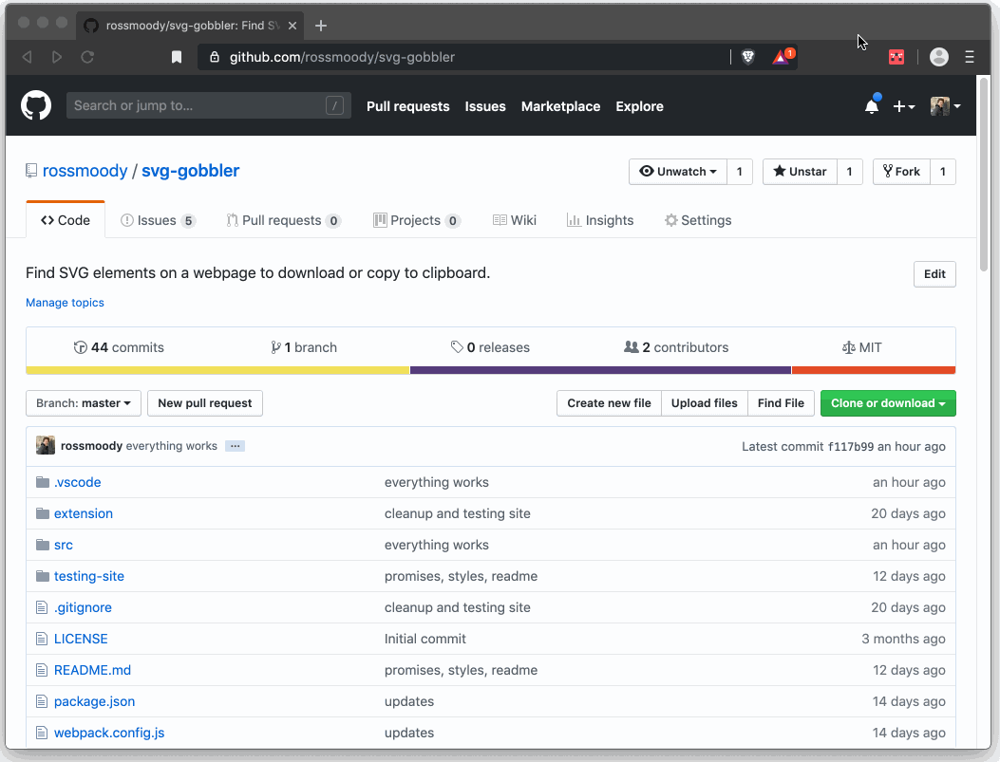

<p align="center">

</p>
<h1 align="center">SVG Gobbler</h1>

<h4 align="center"><a href="https://chrome.google.com/webstore/detail/svg-gobbler/mpbmflcodadhgafbbakjeahpandgcbch?hl=en-US&authuser=0">Download this extension</a> on the Chrome Web store for use in <a href="www.brave.com/download">Brave</a> or <a href="https://ernestsembutnieks.com/brave-browser-vs-google-chrome/">Chrome.</a></h4>

<p align="center">SVG Gobbler is a simple browser extension that highlights any available SVG content in your current window and lets you download or copy it. It also give you the option of optimizing the SVG file with SVGO before exporting.</p>

<h2 align="center"><a href="https://chrome.google.com/webstore/detail/svg-gobbler/mpbmflcodadhgafbbakjeahpandgcbch?hl=en-US&authuser=0"> Download SVG Gobbler</a></p>

## 🎉 How to use

<p></p>

<br />

Click the SVG Gobbler extension icon to search the current page for SVGs.

## Developer mode

Currently, if you would like to use or modify this extension you will need to install it manually. Before making edits you will need to build it locally and side load SVG Gobbler as a developer extension to test any changes.

## Installation

1. Clone the repo and `cd` into the root folder
2. Run `npm install` to install necessary dependencies
3. Run `npm run build` to bundle and build the latest `style.css` file and `index.js` file into the `extension` folder. This also tells webpack to watch for edits

Once this is complete you have all you need to side load the extension and start hacking. Editing content in the `src` directory will automatically build and update the extension folder which will feed the extension in the browser the latest code.

## Side load extension

1. Open Chrome or Brave Browser
2. In the address bar, navigate to `chrome://extensions`
3. In the top right of the screen, flip the toggle to enable `Developer Mode`
4. Click the button to `Load unpacked` and select the `extension` folder inside the cloned SVG Gobbler repo

## Start testing server

You can start up a testing server webpage that includes different SVG import syntaxes for testing by running:

```
npm start
```

This will start the webpack dev server from the `test-server` directory. You can visit http://localhost:8080 to see the page.

## Contribute back

Feel free to submit a pull request if you've made an improvement of some kind. This is a small hobby project and I'm not very good at javascript.

## Permissions

The extension requires permission to read and modify all the data of the website that you want to download the svg files from. It is nessesary to parse and extract the svg assets on the site.

### About

This started as a pet project to improve the [SVG Crowbar](http://nytimes.github.com/svg-crowbar/) tool that is no longer being maintained by NY Times. It has come a long way since then but I always appreciated the simplistic approach they started and it's nice to pay homage.

## Third party dependencies

#### [FileSaver.js](https://github.com/eligrey/FileSaver.js)

Used to export the SVG strings to file or clipboard.

#### [SVGO](https://github.com/svg/svgo)

Node tool used to optimize the SVG content before exporting.

### Very Helpful Articles

- [Scaling SVG Article](https://css-tricks.com/scale-svg/p)
