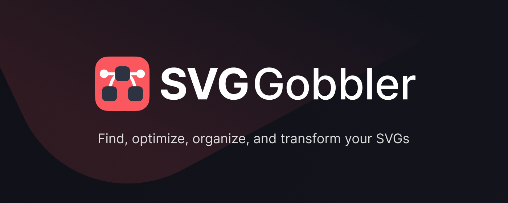
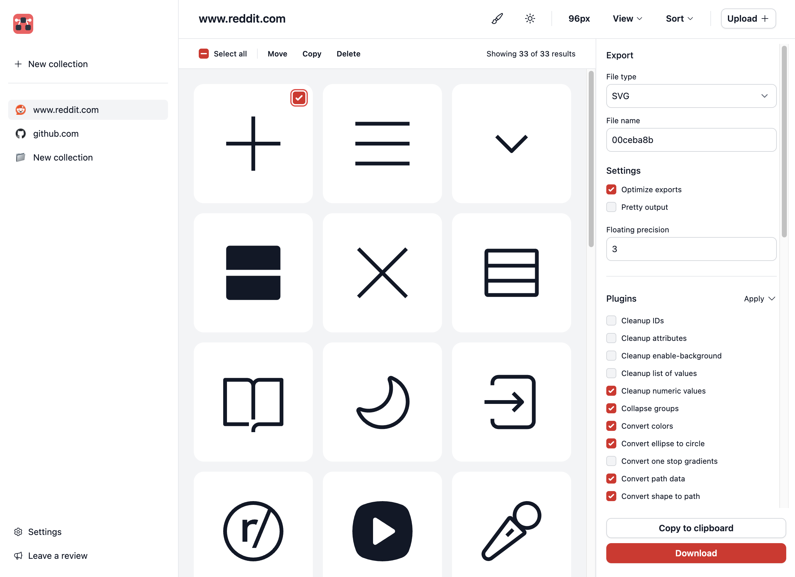

<div align="center">
 <a href="https://svggobbler.com">
  
 </a>
 <br>
</div>

## 🚀 Where to install

This extension is available on:

- [Chrome Web store](https://chrome.google.com/webstore/detail/svg-gobbler/mpbmflcodadhgafbbakjeahpandgcbch)
- [Firefox Addon Marketplace (locked to v3)](https://addons.mozilla.org/firefox/addon/svg-gobbler/)

---

<div align="center">
 <a href="https://svggobbler.com">
  
 </a>
 <br>
</div>

## Features

SVG Gobbler is a browser extension that finds the SVG content in your current tab and lets you
optimize, download, copy, edit, or export.

### Find SVGs

- Quickly find SVGs from a site by various placement methods like `base64` or `background src`
- Handle CORs restricted SVGs from a page
- Find individual sprite SVG instances

### Export SVGs

- Export as SVG, PNG, WEBP, JPEG and various other formats
- Transform SVGs into minified Data URIs
- Transform SVGs into React components with SVGR
- Optimize and minify SVGs with SVGO

### Organize SVGs

- Group and categorize SVGs by their primary domain or custom collection name
- Move, copy, duplicate, and optimize icons before sharing
- Save and store a set of uploaded SVGs for optimization

---

## Local development

Before making edits you will need to build the extension locally and side load it as a developer
extension to test any changes.

> The sourcing and processing logic is abstracted into a separate package called
> `svg-gobbler-scripts` [here](https://github.com/rossmoody/svg-gobbler-scripts).

### 1. Clone the repo

Clone the repo to your local machine and navigate into the root directory.

```shell
cd svg-gobbler
```

### 2. Install dependencies

SVG Gobbler uses yarn to build the necessary dependencies.

```shell
pnpm i
```

### 3. Start and watch a build

For development with hot reloading use Vite:

```bash
pnpm dev
```

This will build to the `dist` folder. To load the extension, open the Extensions Dashboard, enable
"Developer mode", click "Load unpacked", and choose the `dist` folder.

When you make changes in src the background script and any content script will reload automatically.

### 4. Start the server (optional)

Most functionality works without a server, but if you need to make local fetch calls, open a
separate terminal, navigate to the `server` directory, and start the server from there.

```bash
cd server
```

Install the necessary dependencies

```bash
pnpm i
```

From this directory, compile the server function to the `dist` folder.

```bash
pnpm build
```

In a separate terminal session serve the function on a local server.

```bash
pnpm serve
```

This will startup the server and restart it any time a change is recompiled.

---

## About

5 versions and 7+ years ago, this started as a pet project to improve the
[SVG Crowbar](https://github.com/nytimes/svg-crowbar) tool that is no longer being maintained by NY
Times.

### Powered by

This project benefits from some incredibly talented folks.

- [Vite](https://vitejs.dev/): Frontend tooling and build processes
- [CRXJS](https://github.com/crxjs/chrome-extension-tools): Chrome extension build automation
- [Tailwind CSS](https://tailwindcss.com/): CSS styling around the app
- [SVGR](https://react-svgr.com/): SVG to React component transformation
- [SVGO](https://github.com/svg/svgo): SVG optimization scripts
- [Codemirror](https://codemirror.net/): Extensible code editor
- [Radix UI](https://www.radix-ui.com/): Accessible component library primitives
- [JSZip](https://stuk.github.io/jszip/): Zipping files for download
- [Mini SVG Data URI](https://github.com/tigt/mini-svg-data-uri): Minify SVG data URIs
- [React Router](https://reactrouter.com/en/main): App routing

### Open source

This extension is open source and doesn't collect any information from users. It's free, and made
available because I enjoy making useful things for the web. Please consider contributing with an
idea, bug fix, or feature request.

---

## More apps by me

I like making things. [Check out what I'm up to lately](https://rossmoody.com).
